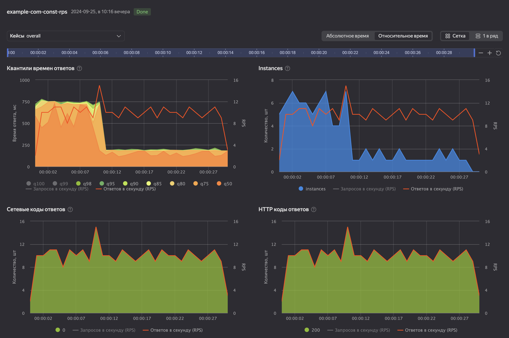
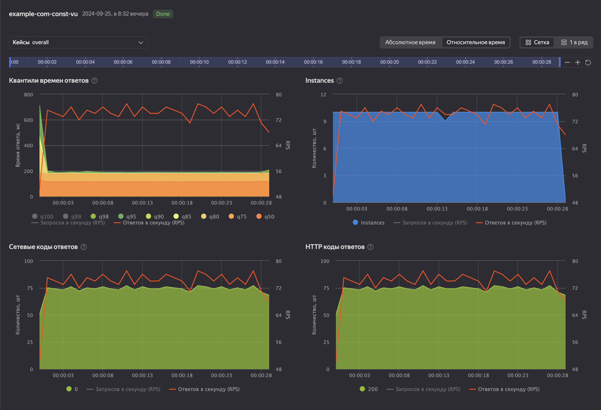
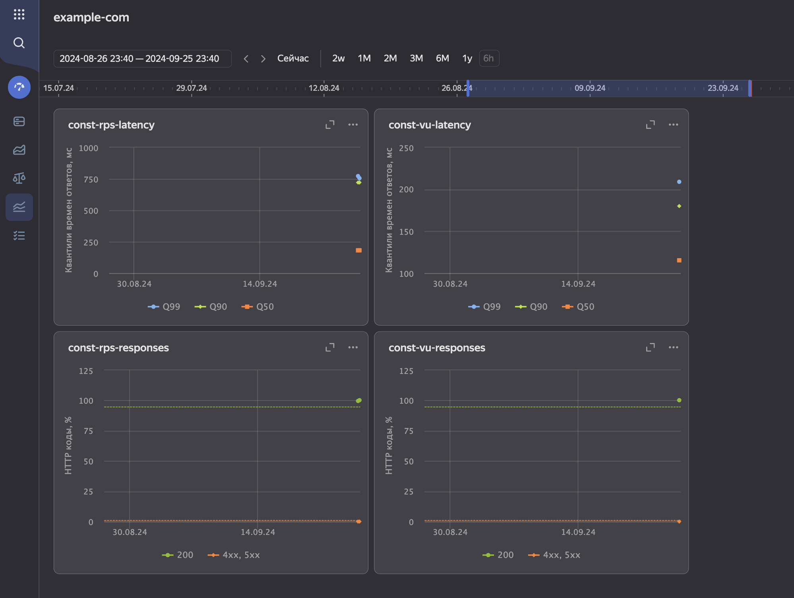

# Проверка результатов нагрузочного теста Yandex Load Testing и определение наличия регрессии с помощью инструмента YC CLI.

В данном сценарии вы научитесь использовать [регрессии нагрузочных тестов Yandex Load Testing](https://yandex.cloud/ru/docs/load-testing/concepts/load-test-regressions) для отслеживания деградации производительности сервиса на стадии CI/CD.

## Запускаем тесты

Запускать мы будем два вида нигрузочных тестов, отличающихся друг от друга схемой подачи нагрузки:
- тест с постоянным количеством RPS
- тест с постоянным количеством виртуальных пользователей

> [!NOTE]
> О том, как запускать нагрузочные тесты с YC CLI, подробно написано [в другом примере](https://github.com/yandex-cloud-examples/yc-load-testing-start-test). В целях наглядности, мы будем использовать упрощенный вариант конфигурации запуска. В нем будут отсутствовать:
> - указание дополнительных файлов с тестовыми данными (запросами)
> - настройки выбора агента
> - настройки выгрузки артефактов теста в бакет Object Storage
> - ...

Итак, для начала, создадим файлы конфигурации тестов:

Первый тест - нагрузка с фиксированным количеством запросов в секунду ([configs/const-rps-test-config.yaml](configs/const-rps-test-config.yaml)): 
<details><summary>configs/const-rps-test-config.yaml</summary> 

```yaml
pandora:
  enabled: true
  package: yandextank.plugins.Pandora
  config_content:
    pools:
      - id: HTTP
        discard_overflow: true
        gun:
          type: http
          target: 'example.com:443'
          ssl: true
        ammo:
          type: uri
          uris:
            - '/'
        startup:
          type: once
          times: 100
        rps:
          - duration: 30s
            type: const
            ops: 10

autostop:
  enabled: true
  package: yandextank.plugins.Autostop
  # force stop if:
  autostop:
    # 1m min passed
    - limit(1m)
```

</details>

Второй тест - нагрузка с фиксированным количеством одновременно активных виртуальных пользователей ([configs/const-vu-test-config.yaml](configs/const-vu-test-config.yaml)): 
<details><summary>configs/const-vu-test-config.yaml</summary> 

```yaml
pandora:
  enabled: true
  package: yandextank.plugins.Pandora
  config_content:
    pools:
      - id: HTTP
        discard_overflow: false
        gun:
          type: http
          target: 'example.com:443'
          ssl: true
        ammo:
          type: uri
          uris:
            - '/'
        startup:
          type: once
          times: 10
        rps:
          - duration: 30s
            type: unlimited

autostop:
  enabled: true
  package: yandextank.plugins.Autostop
  # force stop if:
  autostop:
    # 1m min passed
    - limit(1m)
```

</details>

Чтобы не повторять одни и те же команды на каждом шаге, сами вызовы YC CLI вынесем в отдельный bash script (результат: [result/1-run-test.sh](result/1-run-test.sh)):
```bash
#!/bin/bash

# печатать выполняемые команды + завершать скрипт при ошибке в выполняемой команде
set -ex

# сохраняем переданные аргументы командной строки в отдельные переменные
CONFIG_FILE=$1 # путь до файла конфигурации теста
TAG=$2 # метка-идентификатор типа теста

# создаем конфигурацию теста, id созданной конфигурации сохраняем в переменную с помощью утилиты jq
CONFIG_ID=$(yc --format json loadtesting test-config create --from-yaml-file "$CONFIG_FILE" | jq -r '.id')

# запускаем тест, указав флаг --wait, чтобы команда не завершалась до завершения самого теста
yc loadtesting test create --name "example-com-$TAG" \
    --labels "service=example-com,load=$TAG" \
    --configuration "id=$CONFIG_ID,agent-by-filter=" \
    --wait

```


Запускаем первый тест: 

<details><summary>./result/1-run-test.sh configs/const-rps-test-config.yaml const-rps</summary>

```
> ./result/1-run-test.sh configs/const-rps-test-config.yaml const-rps
+ CONFIG_FILE=configs/const-rps-test-config.yaml
+ TAG=const-rps
++ yc --format json loadtesting test-config create --from-yaml-file configs/const-rps-test-config.yaml
++ jq -r .id
+ CONFIG_ID=ff68skcnj0e16jp2y0s1
+ yc loadtesting test create --name example-com-const-rps --labels service=example-com,load=const-rps --configuration id=ff68skcnj0e16jp2y0s1,agent-by-filter= --wait
done (48s)
id: ff6a0g067g7j6ewm9201
configurations:
  - config_id: ff68skcnj0e16jp2y0s1
    agent_selector:
      match_by_filter: ""
details:
  name: example-com-const-rps
  tags:
    - key: service
      value: example-com
    - key: load
      value: const-rps
summary:
  status: DONE
  created_at: "2024-09-25T19:16:38.407810Z"
  created_by: ajejt4q4ad3q329dj7t4
  started_at: "2024-09-25T19:16:39.913785Z"
  finished_at: "2024-09-25T19:17:26.158676Z"
  is_finished: true
  imbalance_point: {}
  assigned_agent_id: ff611efq0maczhcc4ed9
folder_id: b1g30b1ukltncq2jsdnn
```

</details>

И второй: `./result/1-run-test.sh configs/const-vu-test-config.yaml const-vu`

<details><summary>./result/1-run-test.sh configs/const-vu-test-config.yaml const-vu</summary>

```
> ./result/1-run-test.sh configs/const-vu-test-config.yaml const-vu
+ CONFIG_FILE=configs/const-vu-test-config.yaml
+ TAG=const-vu
++ yc --format json loadtesting test-config create --from-yaml-file configs/const-vu-test-config.yaml
++ jq -r .id
+ CONFIG_ID=ff646pjh8t8vk9pmztt2
+ yc loadtesting test create --name example-com-const-vu --labels service=example-com,load=const-vu --configuration id=ff646pjh8t8vk9pmztt2,agent-by-filter= --wait
done (47s)
id: ff68mx65p6z42w3eyrgj
configurations:
  - config_id: ff646pjh8t8vk9pmztt2
    agent_selector:
      match_by_filter: ""
details:
  name: example-com-const-vu
  tags:
    - key: service
      value: example-com
    - key: load
      value: const-vu
summary:
  status: DONE
  created_at: "2024-09-25T17:32:02.966663Z"
  created_by: ajejt4q4ad3q329dj7t4
  started_at: "2024-09-25T17:32:03.339697Z"
  finished_at: "2024-09-25T17:32:49.596199Z"
  is_finished: true
  imbalance_point: {}
  assigned_agent_id: ff611efq0maczhcc4ed9
folder_id: b1g30b1ukltncq2jsdnn
```

</details>

Как результат, на странице "Тесты" сервиса Load Testing, появилось два новых теста. Посмотрев на графики с результатами, мы можем понять характерные времена ответа сервиса для обоих типов нагрузки и убедиться в корректности приходящих ответов (HTTP 200 OK: 100%).

<details><summary>Графики с результатами</summary>




</details>

## Создаем графики регрессий

Пока что, оценить валидность результатов проводимых тестов мы можем только с помощью вдумчивого анализа. Попробуем автоматизировать этот процесс, используя [регрессии нагрузочных тестов](https://yandex.cloud/ru/docs/load-testing/concepts/load-test-regressions). 

> [!TIP]
> Настроив графики регрессий, мы получим возможность смотреть на эволюцию интегральных метрик наших тестов на большом временном отрезке, а благодаря возможности настроить пороговые значения на этих графиках - при первом взгляде понимать, в какой момент метрики перестали удовлетворять желаемым значениям.

Настроим графики регрессий для двух наших тестов, воспользовавшись веб-интерфейсом консоли управления (см. [инструкцию](https://yandex.cloud/ru/docs/load-testing/operations/regressions)):
1. В сервисе Load Testing, переходим в раздел "Регрессии"
1. Создаем новый дашборд c именем `example-com`. Переходим на страницу дашборда.
1. В режиме редактирования дашборда, добавляем несколько графиков:
    1. Статистика времен ответов, по одному графику на каждый тест:
        - Имя: const-rps-latency (const-vu-latency)
        - Тип данных: Время ответа: куммулятивные квантили
        - Квантили: 50, 90, 99
        - Правила добавления теста / Имя теста: example-com-const-rps (example-com-const-vu)
    1. Статистика по количеству кодов ответов, так же по одному графику на тест:
        - Имя: const-rps-responses (const-vu-responses)
        - Тип данных: HTTP-коды: проценты
        - `200` (порог - `>= 95`), `4xx,5xx` (порог - `<= 1`)
        - Правила добавления теста / Имя теста: example-com-const-rps (example-com-const-vu)
1. Сохраняем дашборд

<details><summary>Результат</summary>



> [!TIP]
> Линии на двух нижних графиках соответствуют значениями настроенных нами порогов

</details>

## Получаем информацию о регрессиях из YC CLI

Информацию по конкретному тесту, которая доступна визуально на странице дашборда регрессий, можно получить и в виде текста (json/yaml). Для этого, нужно воспользоваться командой YC CLI `yc loadtesting test check-regression <TEST_ID>`.

> [!IMPORTANT]
> Справка по команде: [CLI Reference](https://yandex.cloud/ru/docs/cli/cli-ref/managed-services/loadtesting/test/check-regression)
>  <details><summary>yc loadtesting test check-regression -h</summary>
>
>  ```
>  Examples:
>    check-regression <TEST-ID>
>    check-regression <TEST-ID> --dashboard <DASHBOARD-NAME> --chart <CHART-NAME>
>    check-regression <TEST-ID> --dashboard-id <DASHBOARD-ID> --chart-id <CHART-ID>
>
>
>  Flags:
>        --id string             Load testing test id.
>    -e, --error-mode            Set a non-0 exit status of a command if a given test didn't pass regression checks, or no checks were performed.
>        --dashboard-id string   ID of a regression dashboard to be checked.
>        --dashboard string      Name of a regression dashboard to be checked.
>        --chart-id string       ID of a regression chart to be checked.
>        --chart string          Name of a regression chart to be checked.
>  ```
>
></details>
>

Вызовем эту команду, передав ID двух запущенных ранее тестов:

```
> yc loadtesting test check-regression ff6a0g067g7j6ewm9201

                     Test:   example-com-const-rps (id=ff6a0g067g7j6ewm9201)
----------------------------------------------------------------------------
   Charts checked (count):                                                 2
               Thresholds:                                   2 OK / 0 FAILED


   status   value     threshold        fn                                metric      case                 chart     dashboard
-----------------------------------------------------------------------------------------------------------------------------
        -     755             -       q99                               Latency   overall     const-rps-latency   example-com
        -     720             -       q90                               Latency   overall     const-rps-latency   example-com
        -     182             -       q50                               Latency   overall     const-rps-latency   example-com
       OK     100   value >= 95   percent        Responses: protocol code (200)   overall   const-rps-responses   example-com
       OK       0    value <= 1   percent   Responses: protocol code (4xx, 5xx)   overall   const-rps-responses   example-com


> yc loadtesting test check-regression ff68mx65p6z42w3eyrgj

                     Test:   example-com-const-vu (id=ff68mx65p6z42w3eyrgj)
---------------------------------------------------------------------------
   Charts checked (count):                                                2
               Thresholds:                                  2 OK / 0 FAILED


   status   value     threshold        fn                                metric      case                chart     dashboard
----------------------------------------------------------------------------------------------------------------------------
        -     209             -       q99                               Latency   overall     const-vu-latency   example-com
        -     180             -       q90                               Latency   overall     const-vu-latency   example-com
        -     115             -       q50                               Latency   overall     const-vu-latency   example-com
       OK     100   value >= 95   percent        Responses: protocol code (200)   overall   const-vu-responses   example-com
       OK       0    value <= 1   percent   Responses: protocol code (4xx, 5xx)   overall   const-vu-responses   example-com
```

Так как тесты попадают на графики регрессий автоматически (если удовлетворяют "Правилам добавления теста" графика), подобную информацию можно получить и для всех последующих запусков.

Для демонстрации, запустим `const-rps` тест еще раз, и сразу же запросим отчет о регрессиях:

```
> ./result/1-run-test.sh configs/const-rps-test-config.yaml const-rps | grep "^id:" | head -1 | cut -w -f 2 | xargs yc loadtesting test check-regression
+ CONFIG_FILE=configs/const-rps-test-config.yaml
+ TAG=const-rps
++ yc --format json loadtesting test-config create --from-yaml-file configs/const-rps-test-config.yaml
++ jq -r .id
+ CONFIG_ID=ff6n7hf9na7sy3wsj4sc
+ yc loadtesting test create --name example-com-const-rps --labels service=example-com,load=const-rps --configuration id=ff6n7hf9na7sy3wsj4sc,agent-by-filter= --wait
...1s...6s...11s...17s...22s...28s...33s...38s...44s...49s...done (51s)

                     Test:   example-com-const-rps (id=ff6xmhph4psj34z739cb)
----------------------------------------------------------------------------
   Charts checked (count):                                                 2
               Thresholds:                                   2 OK / 0 FAILED


   status   value     threshold        fn                                metric      case                 chart     dashboard
-----------------------------------------------------------------------------------------------------------------------------
        -     750             -       q99                               Latency   overall     const-rps-latency   example-com
        -     715             -       q90                               Latency   overall     const-rps-latency   example-com
        -     180             -       q50                               Latency   overall     const-rps-latency   example-com
       OK     100   value >= 95   percent        Responses: protocol code (200)   overall   const-rps-responses   example-com
       OK       0    value <= 1   percent   Responses: protocol code (4xx, 5xx)   overall   const-rps-responses   example-com
```

## Получение информации о нарушенных порогах

На показанных ранее примерх, все метрики тестов удовлетворяли настроенным на графиках пороговым значениям. Создадим нарушение этих порогов искусственно, добавив запросы несуществующего URI (404 NOT FOUND) в файл конфигурации `const-vu` (см. [configs/const-vu-with-404-test-config.yaml](configs/const-vu-with-404-test-config.yaml)):
```yaml
# pandora.config_content.poools.0:
        ammo:
          type: uri
          uris:
            - '/'
            - '/not-found'
```

Запутим тест, ожидая при этом увидеть нарушение обоих порогов (в тесте будет сделано одинаковое количество `/` и `/not-found` запросов, и, следовательно, получено одинаковое количество 200 и 404 кодов ответов):

```
> ./result/1-run-test.sh configs/const-vu-with-404-test-config.yaml const-vu | grep "^id:" | head -1 | cut -w -f 2 | xargs yc loadtesting test check-regression
+ CONFIG_FILE=configs/const-vu-with-404-test-config.yaml
+ TAG=const-vu
++ yc --format json loadtesting test-config create --from-yaml-file configs/const-vu-with-404-test-config.yaml
++ jq -r .id
+ CONFIG_ID=ff64epkkr624bychp4hz
+ yc loadtesting test create --name example-com-const-vu --labels service=example-com,load=const-vu --configuration id=ff64epkkr624bychp4hz,agent-by-filter= --wait
...1s...6s...11s...16s...22s...27s...32s...38s...43s...48s...done (53s)

                     Test:   example-com-const-vu (id=ff6hn2aqh1q82qsbhst9)
---------------------------------------------------------------------------
   Charts checked (count):                                                2
               Thresholds:                                  0 OK / 2 FAILED


   status   value     threshold        fn                                metric      case                chart     dashboard
----------------------------------------------------------------------------------------------------------------------------
        -     198             -       q99                               Latency   overall     const-vu-latency   example-com
        -     186             -       q90                               Latency   overall     const-vu-latency   example-com
        -     171             -       q50                               Latency   overall     const-vu-latency   example-com
   FAILED      50   value >= 95   percent        Responses: protocol code (200)   overall   const-vu-responses   example-com
   FAILED      50    value <= 1   percent   Responses: protocol code (4xx, 5xx)   overall   const-vu-responses   example-com

```

В получившейся таблице видим:
- общую сводку `Thresholds: 0 OK / 2 FAILED`
- `FAILED` статусы у обеих проверок

Поняв, как работать с командой, мы можем изменить наш скрипт для запуска тестов таким образом, чтобы данная таблица выводилась автоматически после каждого запуска (результат: [result/2-run-test.sh](result/2-run-test.sh)):

<details><summary>./result/2-run-test.sh configs/const-vu-with-404-test-config.yaml const-vu 2> /dev/null</summary>

```
> ./result/2-run-test.sh configs/const-vu-with-404-test-config.yaml const-vu 2> /dev/null

                     Test:   example-com-const-vu (id=ff6xf7ntcvzy708a6zmc)
---------------------------------------------------------------------------
   Charts checked (count):                                                2
               Thresholds:                                  0 OK / 2 FAILED


   status   value     threshold        fn                                metric      case                chart     dashboard
----------------------------------------------------------------------------------------------------------------------------
        -     211             -       q99                               Latency   overall     const-vu-latency   example-com
        -     180             -       q90                               Latency   overall     const-vu-latency   example-com
        -     117             -       q50                               Latency   overall     const-vu-latency   example-com
   FAILED      50   value >= 95   percent        Responses: protocol code (200)   overall   const-vu-responses   example-com
   FAILED      50    value <= 1   percent   Responses: protocol code (4xx, 5xx)   overall   const-vu-responses   example-com

```

</details>

## Использование в CI

Для автоматического определения наличия нарушенных порогов в рамках CI, нам нужно модифицировать скрипт таким образом, чтобы при наличии нарушений, он завершался с ненулевым статусом. Проще всего это сделать, используя флаг `-e` в `yc loadtesting check-regression`. 

Воспользуемся этим флагом, перепишем скрипт (результат: [result/3-run-test.sh](result/3-run-test.sh)):
- при отстуствии ошибок и нарушений регрессионных порогов - вывести ОК и завершиться со статусом `0`
- при нарушении порогов - вывести информацию по регрессиям и завершиться со статусом `1`
- при ошибке в любой из подкоманд - завершиться со статусом `!= 0` (см. `set -e`)

Вызовем итоговый скрипт последовательно для обоих тестов:

```
> ./result/3-run-test.sh configs/const-rps-test-config.yaml const-rps 2> /dev/null
ff67xak6h702gj1b2y68 OK

> echo $?
0

> ./result/3-run-test.sh configs/const-vu-with-404-test-config.yaml const-vu 2> /dev/null
ff6eeqd3mpr8a4vzw7v6 has failures!

                     Test:   example-com-const-vu (id=ff6eeqd3mpr8a4vzw7v6)
---------------------------------------------------------------------------
   Charts checked (count):                                                2
               Thresholds:                                  0 OK / 2 FAILED


   status   value     threshold        fn                                metric      case                chart     dashboard
----------------------------------------------------------------------------------------------------------------------------
        -     180             -       q99                               Latency   overall     const-vu-latency   example-com
        -     172             -       q90                               Latency   overall     const-vu-latency   example-com
        -     112             -       q50                               Latency   overall     const-vu-latency   example-com
   FAILED      50   value >= 95   percent        Responses: protocol code (200)   overall   const-vu-responses   example-com
   FAILED      50    value <= 1   percent   Responses: protocol code (4xx, 5xx)   overall   const-vu-responses   example-com

> echo $?
1
```

Результат соответствует ожиданиям. 

Добавив стадию нагрузочного тестирования с вызовом этого скрипта в ваш деплойный CI/CD пайплайн, вы получите возможность реагировать на падения производительности сервиса (по заранее настроенным критериям) и исследовать возможные причины до того, как это повлияет на пользователей.
